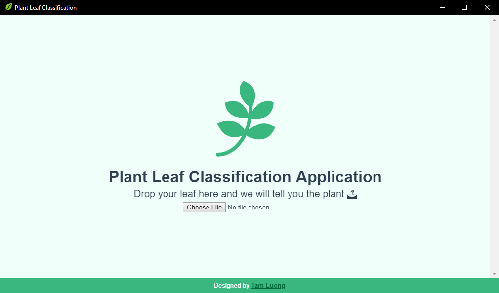
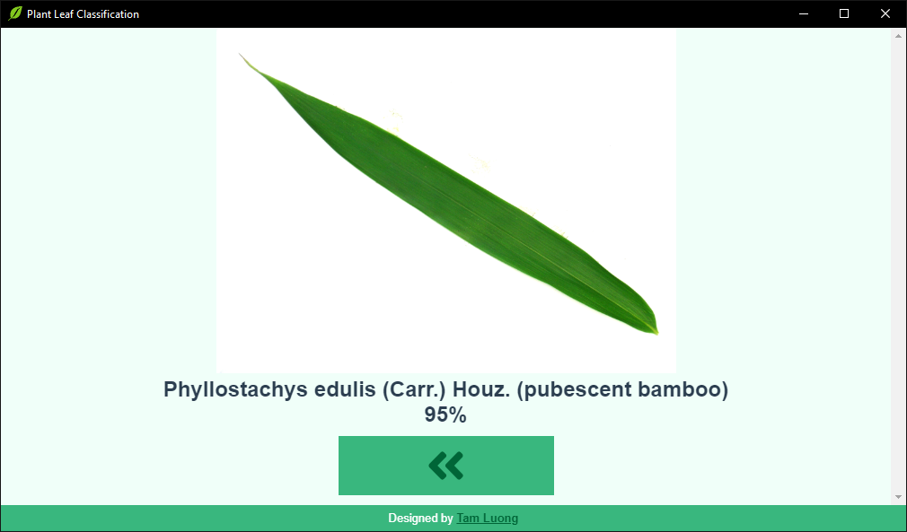

# Plant Leaf Classification
<p align="center">
  <br>
  <i><strong>"Leaves grow from tree"</strong></i>
</p>


**Desciption:** 
> Our work are to build and compare three classification methods to recognise a tree from their leaves.

**Contributors:** Nguyen Vuong Le Minh, Tam Luong <br>

**Dataset:** [Flavia](http://flavia.sourceforge.net)

## **Research Resource**
### Notebook
You can take a look at our notebook **`Notebook.ipynb`** using Jupyter Notebook or Upload it to [Google Colab](https://colab.google.com/).

### Paper & Poster
Our paper and poster are in **`papers`** folder

## **Application**
<p align="center">
   <br>
  User Interface <br>
   <br> 
  Result
</p>

### Download Prebuild
[**Windows Installation**](https://drive.google.com/open?id=1IXeuHQvPx4mzr6nnYJtbVJgZ4yMPYMr5)

### Development
#### Clone this repository
```bash
git clone https://github.com/nguyenvlm/PlantLeafClassification.git
```
#### Install Dependencies
```bash
npm install
```
#### Compiles and hot-reloads for development
```bash
npm run electron:serve
```

#### Compiles and minifies for production
```bash
npm run electron:build
```

#### Lints and fixes files
```bash
npm run lint
```

## **References**

